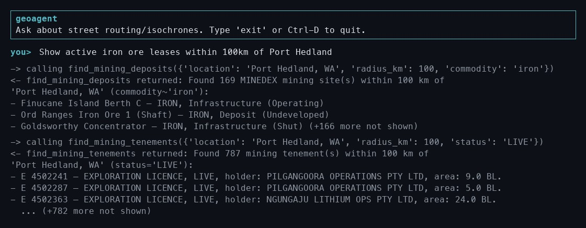
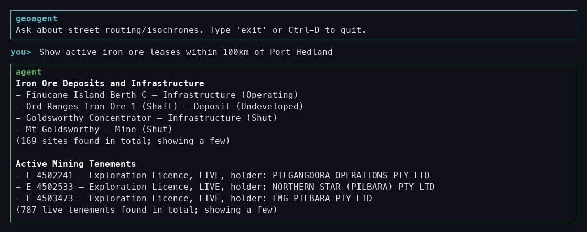
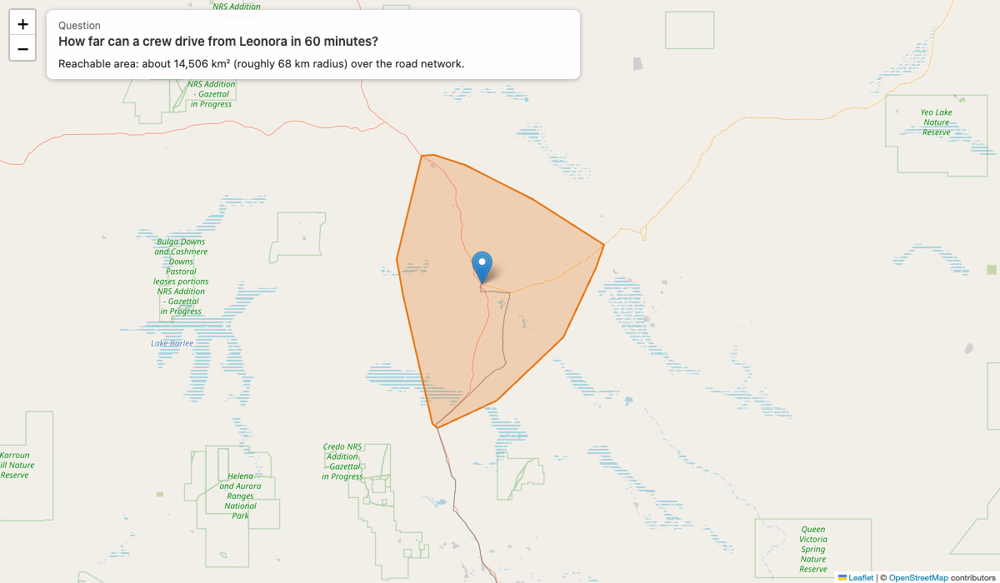
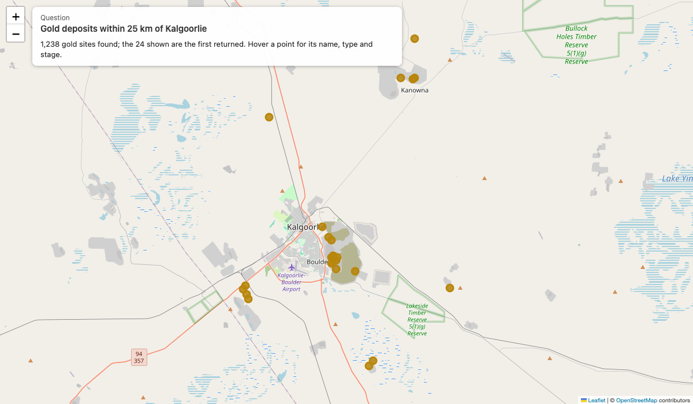
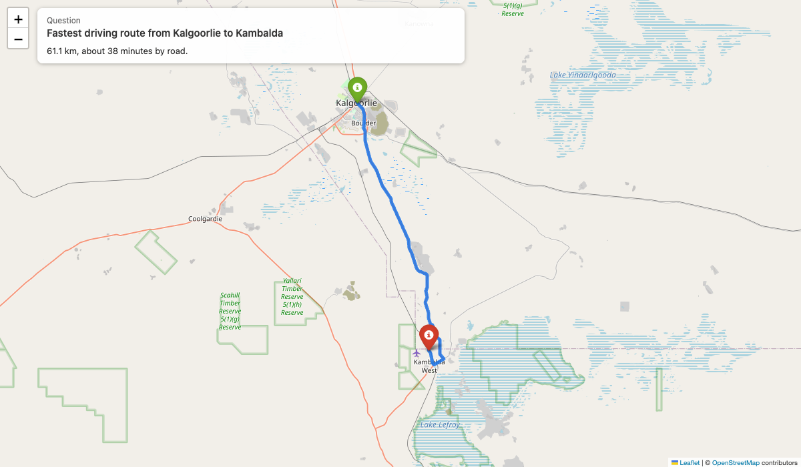
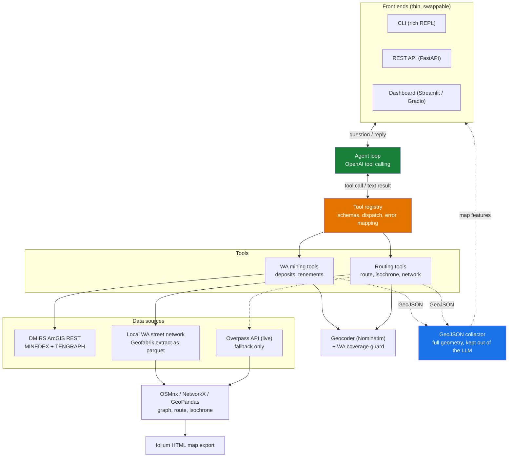
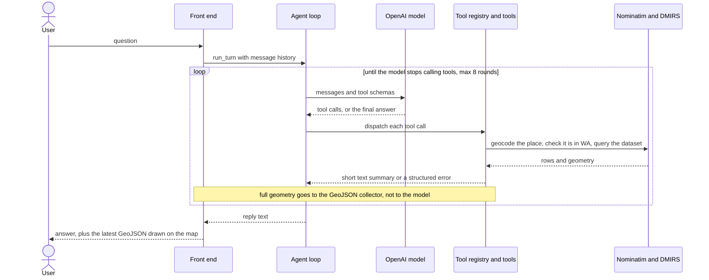

# wa-mining-agent

[](https://github.com/atharvadalvii/wa-mining-agent/actions/workflows/tests.yml)

A natural-language assistant for **Western Australian mining and exploration**. Ask in
plain English ("pending prospecting licences near Coolgardie", "gold deposits near
Kalgoorlie", "how far can a crew drive from Leonora in an hour?") and an LLM calls out
to the right data sources and shows the results on a map. It uses OpenAI's native tool
(function) calling directly, with no agent framework, and has CLI, REST API and web
dashboard front ends over the same core. Coverage is Western Australia only.

**Quick start** (details under [Setup](#setup)):

```bash
pip install -e ".[dev,dashboard]" && cp .env.example .env   # add your OPENAI_API_KEY
streamlit run src/geoagent/dashboard.py                      # chat + live map
```

**Mining data** comes direct from DMIRS's public, unauthenticated ArcGIS REST service:

- mines, mineral deposits, and prospects near a place (`find_mining_deposits`, from
  the MINEDEX dataset), filterable by commodity and/or site type
- mining tenements (legal titles like mining leases and exploration licences) near
  a place (`find_mining_tenements`, from the TENGRAPH system), filterable by tenement
  type and/or status (live/pending only; historical tenements aren't covered). Tenement
  boundaries are drawn on the map.

These two datasets aren't cross-referenced (tenements carry no commodity data, and
deposits carry no legal title info), so a query like "iron ore leases near X" triggers
both tools and the agent presents them as separate results. With `--debug` on, you can
see both real, live tool calls and their raw results:



...and the final reply the agent composes from them:



**Getting around** supports the mining lookups, for example the route from a town to a
mine site, or the area a crew can reach in a given time. Built on OSMnx/GeoPandas street
networks (an offline WA extract, see below):

- fetch/summarize a street network graph (`get_street_network`)
- compute shortest-path routes by distance or travel time (`shortest_route`)
- compute reachable-area isochrones (`isochrone`)

Every `shortest_route`/`isochrone` call also auto-exports an interactive HTML map
(via [folium](https://python-visualization.github.io/folium/)) to the local `maps/`
directory, and the dashboards show the latest result on a live map.

## Examples

Three example questions and the maps they produce. The maps come from the same live
tools the agent calls (real DMIRS data and the local WA street network), run by
`python scripts/generate_readme_maps.py`. **Click a map to open the interactive
version** (pan, zoom and hover for details).

**1. Reachable area: "How far can a crew drive from Leonora in 60 minutes?"**

[](https://htmlpreview.github.io/?https://github.com/atharvadalvii/wa-mining-agent/blob/main/assets/maps/example-isochrone.html)

**2. Mines in an area: "Gold deposits within 25 km of Kalgoorlie"**

[](https://htmlpreview.github.io/?https://github.com/atharvadalvii/wa-mining-agent/blob/main/assets/maps/example-deposits.html)

**3. Shortest path: "Fastest driving route from Kalgoorlie to Kambalda"**

[](https://htmlpreview.github.io/?https://github.com/atharvadalvii/wa-mining-agent/blob/main/assets/maps/example-route.html)

## Architecture



### How one question flows

"Iron ore leases near Port Hedland" end to end:



Two tool calls happen here: `find_mining_deposits` for the iron ore sites and
`find_mining_tenements` for the leases. They are separate datasets, so the model
presents them as two unlinked results.

`geospatial/` holds pure domain logic (OSMnx/NetworkX/GeoPandas/DMIRS calls) with no
knowledge of OpenAI. `tools/` adapts that into OpenAI tool schemas and lossy,
model-readable text summaries. Full data (route coordinates, isochrone polygons)
stays out of the LLM's context but is retained for map export and, via
`tools/geo_context.py`'s context-local collector, for the API's and dashboard's
GeoJSON. `agent/` only talks to the tool registry's generic interface, so it has no
dependency on OSMnx, GeoPandas, or DMIRS at all. `cli.py`, `api.py`, `dashboard.py`,
and `gradio_app.py` are four thin, swappable front ends over the same
`agent/`/`tools/` core.

## Design decisions

- **Native tool calling, no agent framework.** The loop in `agent/loop.py` is under
  60 lines over OpenAI's chat-completions API. The control flow (call model → run tools →
  feed results back) is small enough that a framework would add dependencies and
  indirection without adding capability, and it keeps every step debuggable.
- **The model sees summaries, not geometry.** Tools return short, lossy text (distance,
  duration, counts). Full route coordinates and isochrone polygons never enter the LLM
  context. They are held in a context-local collector (`tools/geo_context.py`) and used
  for map export and the API/dashboard GeoJSON. This bounds token cost and keeps the
  model from reasoning over (or hallucinating) raw coordinates.
- **Domain logic is separate from the LLM.** `geospatial/` has no OpenAI dependency and
  can be tested and reused on its own; `agent/` knows only the tool registry's generic
  interface. Front ends (CLI, FastAPI, Streamlit, Gradio) are thin and interchangeable.
- **Failures are returned to the model, not raised.** Any exception inside a tool is
  converted to a structured JSON error (`tools/errors.py`) and handed back, so the model
  can explain the problem in plain language. The system prompt tells it not to retry an
  identical failing call more than once, and a per-message cap on tool-call iterations
  (`GEOAGENT_MAX_TURNS`, default 8) guarantees the loop terminates.
- **One region, done properly.** The tool is deliberately scoped to Western Australia:
  locations outside it are rejected up front with a clear message. The public Overpass
  API proved unreliable, so routing is served from a local OSM extract of WA (see below),
  with live Overpass only as a fallback inside WA until that extract is built. Live
  fetches run under a hard wall-clock timeout with bounded retries so a rate-limited
  server can't hang a request indefinitely.
- **Model output is untrusted input.** The DMIRS ArcGIS API takes a raw SQL-like `WHERE`
  expression with no parameter binding, and the commodity/tenement filters in it are
  chosen by the LLM from user text. `geospatial/wa_mining.py` strips everything except
  letters, digits, spaces and hyphens from each filter value before it goes into the
  query, so a prompt-injected or malformed value can't change the query's structure.
- **Geocoding is ranked, not first-hit.** Nominatim's top result for many WA towns is an
  administrative boundary (for "Leonora, WA" it is the *Shire of Leonora*, whose centre is
  ~55 km from the town), which would silently centre every result in the wrong place.
  `geospatial/geocode.py` asks for several results and prefers the actual settlement.
  Every location also passes a Western Australia check before any data is fetched.
- **Stateless API.** `POST /query` holds no server-side session; the client passes the
  conversation `history` back each turn, so there is no session state to share between
  instances. (Each worker still holds its own in-memory street-network cache; see
  Performance and cost.)

## Requirements

- Python 3.10+
- An OpenAI API key with available credits

## Setup

```bash
python3.10 -m venv .venv
source .venv/bin/activate
pip install -e ".[dev]"
cp .env.example .env
```

Edit `.env` and set `OPENAI_API_KEY` to your real key.

## Running

```bash
geoagent
# or: python -m geoagent.cli
```

Type a question at the `you>` prompt, e.g.:

```
you> pending prospecting licences near Coolgardie
you> how far can I drive from Leonora in 60 minutes?
```

Flags:

- `--debug`: echo tool calls/results to stderr as they happen
- `--no-cache`: disable OSMnx's disk cache for this run (forces fresh OSM fetches)

Type `exit`, `quit`, or Ctrl-D to leave the REPL.

## API

An optional HTTP microservice wrapping the same agent, for scripting or a future
frontend, is available via [FastAPI](https://fastapi.tiangolo.com/):

```bash
pip install -e ".[dev,api]"
uvicorn geoagent.api:app --reload
```

- `GET /health`: liveness check
- `POST /query`: `{"message": str, "history": [...]}` (both required except
  `history`, which defaults to `[]`) → `{"reply": str, "history": [...], "geojson": {...}}`

The API is **stateless**: it holds no server-side session, so a multi-turn
conversation is continued by passing back the `history` array from the previous
response as the next request's `history`. `geojson` is a `FeatureCollection` built
from whatever routes/isochrones/mining deposits were actually computed during that
turn's tool calls: a `LineString` per route, a `Polygon` per isochrone, a `Point`
per mining deposit, and a `Polygon` per mining tenement (boundary from the DMIRS
service).

```bash
curl -s -X POST localhost:8000/query \
  -H "Content-Type: application/json" \
  -d '{"message": "gold deposits near Kalgoorlie"}'
```

## Dashboards

Two dashboards (chat plus a live map) are available, both thin front ends over the
same agent (no HTTP call to `api.py` involved; each imports `agent`/`tools`
directly, like the CLI does). Pick whichever fits your stack.

### Streamlit

```bash
pip install -e ".[dev,dashboard]"
streamlit run src/geoagent/dashboard.py
```

### Gradio

```bash
pip install -e ".[dev,gradio]"
python -m geoagent.gradio_app
```

Gradio has no native Leaflet/folium component, so its map is embedded as raw HTML
(`gr.HTML`) rather than the interactive `streamlit-folium` widget the Streamlit
version uses. It is functionally equivalent, but slightly less native-feeling.

Both auto-fit the map to whatever was just computed (a route line, isochrone
polygon, or mining deposit points) using the same GeoJSON-collection mechanism the
API uses.

## Local WA street network (offline routing)

Without a local extract, routing/isochrone queries fetch street data live from the
public Overpass API, which can be slow or unreliable (some networks route to backend IPs
that flap between working and unreachable within seconds, not hours). Since this tool
only covers Western Australia, you can pre-download a WA-only OSM extract once and route
entirely offline afterward, with no per-query network dependency (recommended):

```bash
pip install -e ".[dev,local-wa]"
python -m geoagent.setup_local_wa   # one-time, ~5-10 min, downloads ~110MB + builds ~1.6GB of local cache
```

This downloads a [Geofabrik](https://download.geofabrik.de/australia-oceania/australia.html)
WA extract and pre-extracts driving/walking/cycling networks into `.cache/local_network/`
(as parquet node/edge tables, not a single prebuilt graph, since building one graph for
the whole state is too slow; a bounding box is filtered from the tables and turned into a
small graph per query instead, which is sub-second once the tables are loaded). Once set
up, any `shortest_route`/`isochrone` query whose points fall within WA automatically uses
this local data, with no code changes needed. Without it, routing falls back to live
Overpass (slower and less reliable).

## Configuration

All settings are read from environment variables (via `.env`):

| Variable | Default | Purpose |
|---|---|---|
| `OPENAI_API_KEY` | *(required)* | OpenAI API key |
| `GEOAGENT_MODEL` | `gpt-4o-mini` | OpenAI model to use |
| `GEOAGENT_CACHE_DIR` | `.cache/osmnx` | OSMnx disk cache directory |
| `GEOAGENT_MAPS_DIR` | `maps` | Where auto-exported route/isochrone HTML maps are saved |
| `GEOAGENT_MAX_TURNS` | `8` | Safety cap on tool-call loop iterations per user message |
| `GEOAGENT_OVERPASS_URL` | *(unset, use OSMnx default)* | Override the Overpass API mirror |
| `GEOAGENT_OVERPASS_RATE_LIMIT` | `true` | Set `false` to disable OSMnx's Overpass rate-limit slot check |

The last two are only needed if your network can't reach OSMnx's default Overpass
mirror (`overpass-api.de`). Leave them unset to get OSMnx's normal, usage-policy-
respecting behavior. If routing/isochrone tool calls fail with connection errors,
try setting `GEOAGENT_OVERPASS_URL=https://overpass.kumi.systems/api` and
`GEOAGENT_OVERPASS_RATE_LIMIT=false`.

## Performance and cost

- **Latency is dominated by graph construction, not the LLM.** For a WA route with the
  local extract, a cold query took roughly 25 s: ~8 s loading the state-wide driving
  tables (once per process), ~8 s cutting out and converting a subgraph, ~5 s adding
  speed/travel-time attributes, and ~4 s for two Nominatim geocodes. Repeating a query
  for the same area within a process hits an in-memory graph cache and is much faster.
  The Streamlit app pre-loads the tables at startup so only the first query pays that
  cost. Without the local extract, queries depend on live Overpass and are bounded to ~40 s per attempt.
- **Each user message costs at least two model calls** (choose tools, then write the
  reply), more for multi-tool queries. The default model is `gpt-4o-mini` to keep this
  low; change it with `GEOAGENT_MODEL`.
- **External services are rate-limited public endpoints.** Nominatim (geocoding) and
  Overpass have usage policies and are not suitable for high-volume traffic as-is. A
  production deployment should self-host them or use a commercial equivalent.
- **Memory and disk.** The local WA cache is ~1.6 GB on disk and is loaded per process,
  so each worker holds its own copy; the in-process graph cache is likewise not shared
  between workers.

## Known limitations

- Western Australia only: locations elsewhere are rejected. The agent handles WA mining
  lookups plus routing and isochrones; it deliberately declines general POI search and
  arbitrary spatial analysis.
- MINEDEX deposits and TENGRAPH tenements are not cross-referenced, results are capped at
  25 features per query, and tenements cover live/pending titles only.
- Isochrones in dense areas (e.g. Perth) are fetched within a fixed-size area to keep
  response times reasonable, so long drive-time areas there are flagged as underestimates
  in the reply. Remote areas expand the fetch until the reachable area is fully covered.
- Routes are capped at 150 km between endpoints.
- Where OSM has no `maxspeed` tags (common in remote WA), drive times use default speeds
  by road type (e.g. 100 km/h trunk, 30 km/h track), so travel times there are rough.
  Walk and bike use constant speeds (5 and 15 km/h) and ignore terrain.
- Geocoding ranks Nominatim's top few results but can still pick the wrong place for
  ambiguous names. The system prompt asks the model to request a locality for bare street
  names, but that is a prompt-level safeguard, not a hard guarantee. The WA check uses a
  coarse bounding box, so points just over the NT/SA border can pass it.
- Street data is from OpenStreetMap and can be incomplete or out of date.

## Testing

```bash
pytest              # unit tests only (fast, no network calls; needs `.[dev,api]` for API tests)
pytest -m integration  # also hits real OSM/Overpass data
```

The unit suite (58 tests, run on every push by GitHub Actions) mocks the OpenAI client and
all external services, so it runs offline in a few seconds. Several tests are regression
tests for failures found in real use (for example drive isochrones breaking where OSM has
no speed limits, a route destination stranded in a disconnected piece of the map, and
geocoding to the shire instead of the town), each written to fail without its fix.
Integration tests hit real OSM data and are excluded by default.

## Project layout

```
src/geoagent/
├── config.py            # env/settings loading, OSMnx cache configuration
├── cli.py                # REPL entrypoint (rich terminal UI)
├── api.py                # FastAPI microservice entrypoint
├── dashboard.py           # Streamlit chat + live map entrypoint
├── gradio_app.py          # Gradio chat + live map entrypoint
├── setup_local_wa.py      # one-time WA offline-extract setup script
├── agent/
│   ├── loop.py            # OpenAI tool-calling loop
│   ├── conversation.py    # message history state
│   └── prompts.py         # system prompt
├── tools/
│   ├── registry.py        # tool schema + dispatch registry (extension point)
│   ├── errors.py          # exception -> structured error string for the model
│   ├── geo_context.py     # context-local GeoJSON feature collector (for api.py/dashboards)
│   ├── routing.py         # street network / route / isochrone tool wrappers
│   └── wa_mining.py       # MINEDEX / mining tenement tool wrappers
└── geospatial/
    ├── network.py          # OSMnx graph fetch + in-process cache
    ├── routing.py          # shortest-path computation
    ├── isochrone.py        # reachable-area computation
    ├── geocode.py          # place name / "lat,lon" resolution, settlement ranking, WA guard
    ├── mapping.py          # folium HTML map export
    ├── local_extract.py    # offline WA street network (see "Local WA street network" above)
    ├── wa_mining.py        # DMIRS ArcGIS REST queries
    └── models.py           # result dataclasses + their model-facing text/GeoJSON summaries
```

Outside `src/`: `tests/` (unit and integration suites), `assets/` (README screenshots and
example maps) and `scripts/generate_readme_maps.py` (regenerates the example maps from the
live tools).

To add a new capability (e.g. POI search), add a `geospatial/<feature>.py` module and
a `tools/<feature>.py` that registers its own tool specs, with no changes needed to `agent/`.
